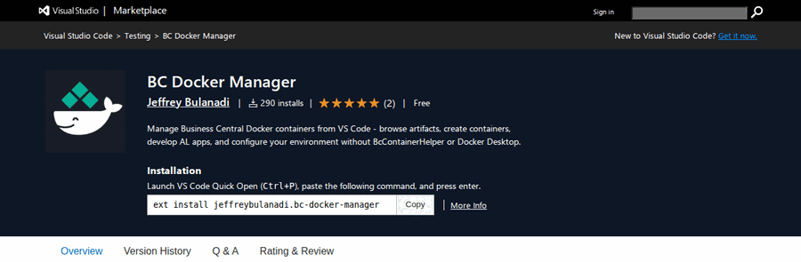
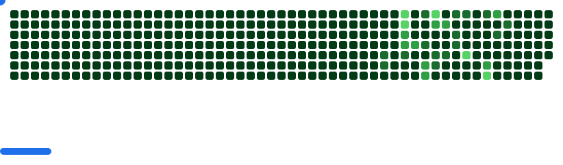

# Yo, I'm Jeffrey Bulanadi

<div align="center">
  
</div>

---

### < Character_Sheet />

- **Software Artisan**, crafting battle-tested solutions from startup to enterprise scale
- **2013 · <!--CURRENT_YEAR-->2026<!--/CURRENT_YEAR-->** spanning the Microsoft and Open Source kingdoms
- **350+ Quests Completed** across Asia, Australia, Europe, and the United States
- **Tech Alchemist** specializing in ERP transformations, system integrations and modular architecture
- **DevOps Sage** orchestrating CI/CD pipelines across Azure clouds and GitHub repositories

---

### Built & Shipped

<div align="center">
  
</div>

**[BC Docker Manager](https://marketplace.visualstudio.com/items?itemName=jeffreybulanadi.bc-docker-manager)**  
[](https://marketplace.visualstudio.com/items?itemName=jeffreybulanadi.bc-docker-manager)
[](https://marketplace.visualstudio.com/items?itemName=jeffreybulanadi.bc-docker-manager)
[](https://marketplace.visualstudio.com/items?itemName=jeffreybulanadi.bc-docker-manager)

A lightweight, all-in-one control center for Business Central Docker development inside VS Code. Browse artifacts, create containers, manage environments, and develop AL apps without BcContainerHelper or Docker Desktop.

**[AL Indent Prism](https://marketplace.visualstudio.com/items?itemName=jeffreybulanadi.al-indent-prism)**  
[](https://marketplace.visualstudio.com/items?itemName=jeffreybulanadi.al-indent-prism)
[](https://marketplace.visualstudio.com/items?itemName=jeffreybulanadi.al-indent-prism)
[](https://marketplace.visualstudio.com/items?itemName=jeffreybulanadi.al-indent-prism)

Rainbow indentation colorizer for Business Central AL files. Lightweight, real-time, and fully configurable. Makes nested AL code actually readable.

**[VSCode Aquarium](https://marketplace.visualstudio.com/items?itemName=jeffreybulanadi.vscodeaquarium)**  
[](https://marketplace.visualstudio.com/items?itemName=jeffreybulanadi.vscodeaquarium)
[](https://marketplace.visualstudio.com/items?itemName=jeffreybulanadi.vscodeaquarium)
[](https://marketplace.visualstudio.com/items?itemName=jeffreybulanadi.vscodeaquarium)

A living freshwater aquarium inside VS Code. Nineteen sprite-animated species swim, school, grow hungry, and hunt each other in real time while you code.

---

### Writing

**[learnbeyondbc.com](https://learnbeyondbc.com)** · Business Central, Reverse Engineered.

Real-world AL patterns, integration secrets, and platform deep dives. Written for developers who want to understand what's actually happening under the hood.

<!--START_SECTION:blog-->
- [BC Docker Manager: The Easiest Way to Run Business Central Containers](https://learnbeyondbc.com/blogs/bc-docker-manager-easy-containers) · Apr 2026
- [Connecting Postman Directly to Azure DevOps & GitHub Repository](https://learnbeyondbc.com/blogs/connecting-postman-to-azure-devops-github-repositories) · Jan 2026
- [Using Raw URLs to Import Postman Collections from Azure DevOps & GitHub](https://learnbeyondbc.com/blogs/using-raw-urls-to-import-postman-collections-azure-devops-github) · Jan 2026
<!--END_SECTION:blog-->

[20+ posts and counting &rarr;](https://learnbeyondbc.com)

---

### GitHub Stats

<div align="center">
  
  
</div>
<div align="center">
  
</div>

---

### GitHub Contributions

<picture>
  <source media="(prefers-color-scheme: dark)" srcset="https://raw.githubusercontent.com/jeffreybulanadi/jeffreybulanadi/output/github-contribution-grid-snake-dark.svg" />
  <source media="(prefers-color-scheme: light)" srcset="https://raw.githubusercontent.com/jeffreybulanadi/jeffreybulanadi/output/github-contribution-grid-snake.svg" />
  
</picture>

<picture>
  <source media="(prefers-color-scheme: dark)" srcset="images/breakout-dark.svg" />
  <source media="(prefers-color-scheme: light)" srcset="images/breakout-light.svg" />
  
</picture>

---

### Connect with Me

[](https://community.dynamics.com/members/jeffreybulanadi)
[](https://linkedin.com/in/jeffreybulanadi)
[](https://x.com/JeffreyBulanadi)
[](https://bsky.app/profile/jeffreybulanadi.bsky.social)
[](https://medium.com/@jeffreybulanadi)
[](https://dev.to/jeffreybulanadi)
[](https://mastodon.social/@jeffreybulanadi)
[](https://coderlegion.com/user/jeffreybulanadi)

---

### Weekly Development Breakdown

<!--START_SECTION:waka-->


📊 **This Week I Spent My Time On** 

```text
💬 Programming Languages: 
AL                       5 hrs 25 mins       ██████░░░░░░░░░░░░░░░░░░░   22.82 % 
Markdown                 5 hrs 22 mins       ██████░░░░░░░░░░░░░░░░░░░   22.62 % 
JSON                     5 hrs 10 mins       █████░░░░░░░░░░░░░░░░░░░░   21.79 % 
TypeScript               2 hrs 6 mins        ██░░░░░░░░░░░░░░░░░░░░░░░   08.84 % 
CSS                      2 hrs 3 mins        ██░░░░░░░░░░░░░░░░░░░░░░░   08.67 % 
```


<!--END_SECTION:waka-->
