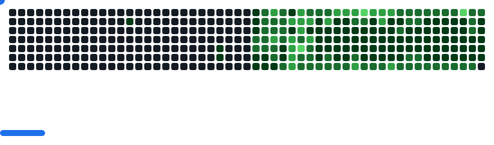

# Jeffrey Bulanadi

### GitHub Contributions

<picture>
  <source
    media="(prefers-color-scheme: dark)"
    srcset="images/breakout-dark.svg"
  />
  <source
    media="(prefers-color-scheme: light)"
    srcset="images/breakout-light.svg"
  />
  
</picture>

<div align="center">
  
</div>

### < Hello_World />
- Software Artisan crafting small-to-large scale business solutions.
- Developer-at-arms with over 13 years of mastery across Microsoft and Open Source ecosystems
- Legendary Quest Log: 350+ implementations delivered across Asia, Australia, Europe, and the United States
- Tech Alchemist for ERP transformations, system integrations, and modular architecture.
- DevOps Sage orchestrating CI/CD pipelines across Azure clouds and GitHub repositories

### 📊 GitHub Stats

<div align="center">
  
  
</div>

### 🤝 Connect with Me

[](https://linkedin.com/in/jeffreybulanadi)
[](https://x.com/JeffreyBulanadi)
[](https://youtube.com/@0xjeffreybulanadi)
[](https://bsky.app/profile/jeffreybulanadi.bsky.social)
[](https://medium.com/@jeffreybulanadi)
[](https://dev.to/jeffreybulanadi)

### 📈 Weekly Development Breakdown

<!--START_SECTION:waka-->


📊 **This Week I Spent My Time On** 

```text
💬 Programming Languages: 
HTML                     7 hrs 58 mins       ██████░░░░░░░░░░░░░░░░░░░   25.15 % 
AL                       3 hrs 45 mins       ███░░░░░░░░░░░░░░░░░░░░░░   11.86 % 
Blade Template           3 hrs 38 mins       ███░░░░░░░░░░░░░░░░░░░░░░   11.49 % 
Markdown                 3 hrs 6 mins        ██░░░░░░░░░░░░░░░░░░░░░░░   09.80 % 
JSON                     2 hrs 40 mins       ██░░░░░░░░░░░░░░░░░░░░░░░   08.43 % 
```


<!--END_SECTION:waka-->

---

<div align="center">
  
</div>
